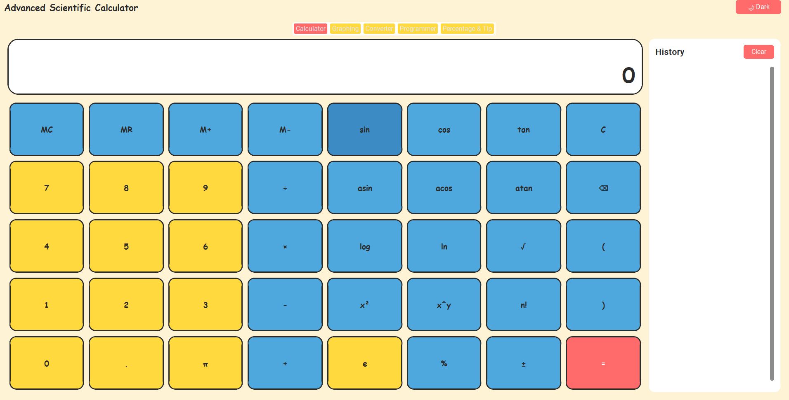

# 🧮 Advanced Scientific Calculator

A modern **Advanced Scientific Calculator** built with **Python** and **CustomTkinter**, featuring a clean Windows 11-inspired interface with multiple mathematical tools, converters, and calculation history.


## 📸 Preview



---

## ✨ Features

### 🧮 Scientific Calculator
- Basic arithmetic operations
- Trigonometric functions
- Inverse trigonometric functions
- Hyperbolic functions
- Logarithms (log, ln)
- Square root
- Power functions
- Factorial
- Percentage calculations
- Mathematical constants (π, e)

### 🔢 Number System Converter
- Decimal ↔ Binary
- Decimal ↔ Octal
- Decimal ↔ Hexadecimal

### 📏 Unit Converter
- Length
- Weight
- Temperature
- Speed
- Time

### 📜 Calculation History
- Automatically stores previous calculations
- Clear history option

### 🎨 Modern User Interface
- Windows 11 inspired design
- Light & Dark themes
- Responsive layout
- Easy-to-use interface

---

## 📂 Project Structure

```
Advanced-Scientific-Calculator/
│
├── calculator.py
├── converter.py
├── baseconv.py
├── history.py
├── theme.py
├── ui.py
├── main.py
├── requirements.txt
├── README.md
├── LICENSE
└── .gitignore
```

---

## 🚀 Installation

### Clone the repository

```bash
git clone https://github.com/srusti-das-git/Advanced-Scientific-Calculator.git
```

### Open the project

```bash
cd Advanced-Scientific-Calculator
```

### Install dependencies

```bash
pip install -r requirements.txt
```

### Run the application

```bash
python main.py
```

---

## 📦 Requirements

- Python 3.10 or later
- CustomTkinter

Install manually if needed:

```bash
pip install customtkinter
```

---

## 🖥️ Technologies Used

- Python
- CustomTkinter
- Tkinter
- Math Module

---

## 🎯 Future Improvements

- Graph Plotter
- Matrix Calculator
- Currency Converter
- Programmer Calculator
- Equation Solver
- Statistics Calculator
- Scientific Graphs
- Export History

---

## 🤝 Contributing

Contributions are welcome.

1. Fork the repository
2. Create your feature branch

```bash
git checkout -b feature-name
```

3. Commit your changes

```bash
git commit -m "Added new feature"
```

4. Push the branch

```bash
git push origin feature-name
```

5. Open a Pull Request

---

## 📄 License

This project is licensed under the MIT License.

See the LICENSE file for more details.

---

## 👨‍💻 Author

Siba Sundar Sahoo

GitHub: https://github.com/sibasundarsahoo08-creator

---

⭐ If you found this project useful, please consider giving it a star.
